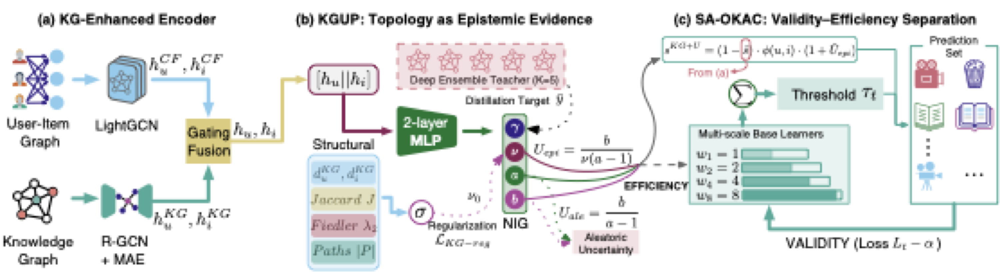

# TRACE: Structure-Adaptive Conformal Recommendation with Knowledge Graph Evidential Priors

[](#)
[](https://opensource.org/licenses/MIT)
[](https://www.python.org/)
[](https://pytorch.org/)

Official repository for the paper:

> **TRACE: Structure-Adaptive Conformal Recommendation with Knowledge Graph Evidential Priors**
>
> Xiaoyan Tian, Min Yu, Naihan Han
>
> *Under review at Neurocomputing*

<p align="center">
  
</p>

## Overview

**TRACE** (**T**opology-**R**egulated **A**daptive **C**onformal **E**vidential Recommendation) formalizes knowledge graph topology as a structural prior for epistemic uncertainty in conformal prediction for recommendation. KG connectivity is treated as virtual evidence in a Bayesian evidential model, yielding tighter prediction sets for well-connected user-item pairs while maintaining finite-sample coverage guarantees.

### Core Components

| Component | Description |
|-----------|-------------|
| **KGUP** | KG-Evidential Uncertainty Probe — single-pass NIG posterior with KG structural priors |
| **SA-OKAC** | Strongly Adaptive Online KG-Aware Calibration — multi-scale online threshold adjustment |
| **CRS** | Conformalized Recommendation Sets — topology-aware nonconformity scoring |

### Theoretical Contributions

1. **Monotone Prior Preservation** (Theorem 1): Under a KG-dominance condition, the learned evidence count preserves the topological ordering.
2. **Structure-Adaptive Tightness** (Theorem 2): Topology-aware scores produce smaller prediction sets for well-connected pairs.
3. **Dynamic Regret Bound** (Theorem 3): SA-OKAC achieves $O(\sqrt{(1+P_T)T\log T})$ dynamic regret, strictly generalizing standard ACI.

## Key Results

### Main Performance (Table 2 in paper)

TRACE achieves valid coverage (≥ 90%) across all datasets with competitive prediction set sizes:

| Dataset | Method | Coverage (%) | Avg Set Size | Cumulative Regret |
|---------|--------|:------------:|:------------:|:-----------------:|
| Amazon-Book | KGAT + ACI | 91.2 | 14.56 | 17,204 |
| Amazon-Book | **TRACE** | **91.5** | **10.57** | **16,611** |
| Last-FM | KGAT + ACI | 95.8 | 9.12 | — |
| Last-FM | **TRACE** | **96.7** | **8.63** | — |
| ML-1M | KGAT + ACI | 90.3 | 14.56 | — |
| ML-1M | **TRACE** | **90.3** | **12.53** | — |

### Ablation Study (Table 3 in paper)

| Variant | Amazon-Book Size | Last-FM Size | ML-1M Size |
|---------|:----------------:|:------------:|:----------:|
| **TRACE (full)** | **10.57** | **8.63** | **12.53** |
| w/o KGUP | 11.14 (+5.4%) | 8.93 (+3.5%) | 12.68 (+1.2%) |
| w/o SA-OKAC | 42.84 | 43.24 | 42.84 |
| Monotone only | 10.82 (+2.4%) | 8.78 (+1.7%) | 12.67 (+1.1%) |

### Inference Speed (Table 5 in paper)

| Method | Time (ms/batch) | Speedup |
|--------|:--------------:|:-------:|
| Deep Ensemble (K=5) | 8.05 | 1.0× |
| MC Dropout (T=50) | 9.94 | 0.8× |
| **KGUP (Ours)** | **1.96** | **5.1×** |

## Experimental Results

The `results/` directory contains all experimental outputs in JSON format, fully reproducible:

```
results/
├── results/              # Main TRACE results (RQ1)
│   ├── kg_race_*.json    # Full TRACE: coverage, set size, regret
│   ├── no_kgup_*.json    # Ablation: w/o KGUP
│   ├── no_okac_*.json    # Ablation: w/o SA-OKAC
│   └── monotone_*.json   # Ablation: monotone constraint only
├── baseline_cp/          # Baseline CP methods (Static CP, ACI, CRC)
├── conditional_cp/       # Conditional coverage analysis
├── lambda_sensitivity/   # λ_KG sensitivity sweep
├── kg_dropout/           # KG edge dropout robustness
└── kg_conflict/          # KG noise/conflict analysis
```

Each JSON file contains: `dataset`, `seed`, `method`, `alpha`, `coverage`, `avg_set_size`, `median_set_size`, `cumulative_regret`, `avg_uncertainty`, `n_test`.

All experiments are run with 3 random seeds (42, 43, 44) for reproducibility.

## Datasets

| Dataset | Users | Items | Interactions | KG Triples | KG Entities |
|---------|:-----:|:-----:|:------------:|:----------:|:-----------:|
| Amazon-Book | 70,679 | 24,915 | 846,434 | 2,557,746 | 88,572 |
| Last-FM | 23,566 | 48,123 | 3,034,796 | 464,567 | 58,266 |
| MovieLens-1M | 6,040 | 3,706 | 1,000,209 | 20,195 | 182,011 |

## Code Availability

> **Note:** To comply with the review process, source code is temporarily withheld. **All code will be released upon paper acceptance**, including:
> - Complete PyTorch implementation of KGUP, SA-OKAC, and CRS
> - KG topology preprocessing (Jaccard overlap, spectral connectivity, meta-path density)
> - End-to-end training and evaluation pipeline
> - Baseline implementations (Static CP, ACI, CRC × {BPR, KGAT, KGIN, LightGCN, NeuMF, SASRec})

## Citation

```bibtex
@article{tian2026trace,
  title={TRACE: Structure-Adaptive Conformal Recommendation with Knowledge Graph Evidential Priors},
  author={Tian, Xiaoyan and Yu, Min and Han, Naihan},
  journal={Under review at Neurocomputing},
  year={2026}
}
```

## License

This project is licensed under the MIT License.

## Contact

For questions about the paper or experimental results, please contact:
- **Xiaoyan Tian** (Corresponding Author): [txy@sdpc.edu.cn](mailto:txy@sdpc.edu.cn)
